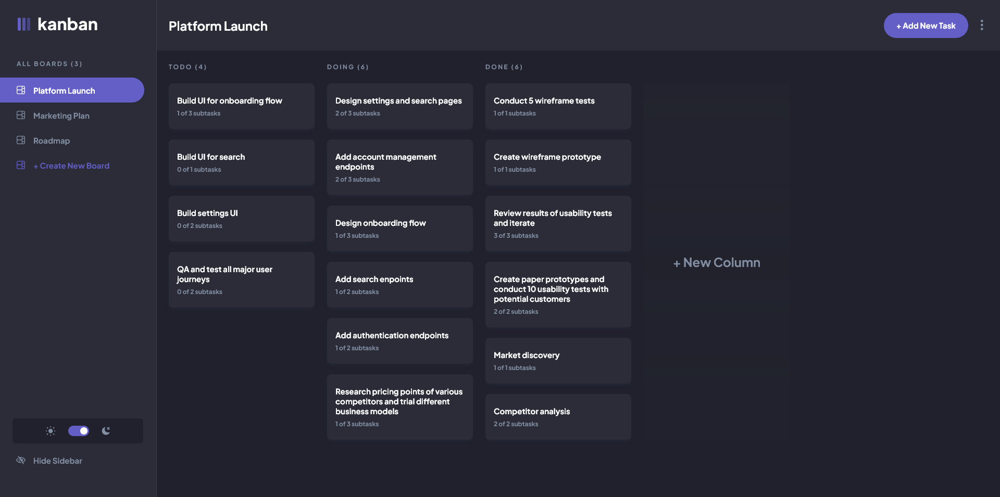

# Frontend Mentor - Kanban task management web app solution

This is a solution to the [Kanban task management web app challenge on Frontend Mentor](https://www.frontendmentor.io/challenges/kanban-task-management-web-app-wgQLt-HlbB). Frontend Mentor challenges help you improve your coding skills by building realistic projects.

## Table of contents

- [Overview](#overview)
  - [The challenge](#the-challenge)
  - [Screenshot](#screenshot)
  - [Links](#links)
- [My process](#my-process)
  - [Built with](#built-with)
  - [What I learned](#what-i-learned)
  - [Continued development](#continued-development)
- [Author](#author)

## Overview

### The challenge

Users should be able to:

- View the optimal layout for the app depending on their device's screen size
- See hover states for all interactive elements on the page
- Create, read, update, and delete boards and tasks
- Receive form validations when trying to create/edit boards and tasks
- Mark subtasks as complete and move tasks between columns
- Hide/show the board sidebar
- Toggle the theme between light/dark modes
- **Bonus**: Allow users to drag and drop tasks to change their status and re-order them in a column
- **Bonus**: Keep track of any changes, even after refreshing the browser (`localStorage` could be used for this if you're not building out a full-stack app)
- **Bonus**: Build this project as a full-stack application

### Screenshot

### Links

- Solution URL: [GitHub solution page](https://github.com/sardarz/kanban_fm)
- Live Site URL: [Add live site URL here](https://your-live-site-url.com)

## My process

### Built with

- HTML
- CSS, CSS modules
- Flexbox
- CSS Grid
- TypeScript
- React
- Redux, Redux Toolkit
- LocalStorage

### What I learned

During the process of developing the solution for kanban web app I was able to bring together things that I'd learned previously: Responsive Design, CSS Flexbox and Grid, React, Redux with Redux Toolkit. 

I have delevoped confidence styling components with CSS after having completed many Newbie and Junior challenges on frontendmentor.io. I was able to use all that knowledge to create an app that is responsive and has components with proper behaviour.

During my time at School of Interface Development by Yandex I further developed my knowledge on React and learned TypeScript, Redux, Redux Toolkit. It was a very interesting experince at the school because I had to learn many things on the go and complete given tasks without prior experience. Here I had the time and opportunity to take things slower and go on my own pace. Because of this I got to understand Redux properly and used it to build the app the way I saw it fit. 

Also, after using TypeScript to build the app I was finally able to see all the benefits that TS brings to developers. It was a very pleasant experience and I'm never coming back to Vanilla JS. 

### Continued development

In the near future I would like to develop the next features:
- Add DnD functionality, either by using an existing library or implementing my own solution.
- Add backend, so that I can learn more about it and make the app fullstack.

## Author

- Website - [Add your name here](https://www.your-site.com)
- Frontend Mentor - [@yourusername](https://www.frontendmentor.io/profile/yourusername)
- Twitter - [@yourusername](https://www.twitter.com/yourusername)

